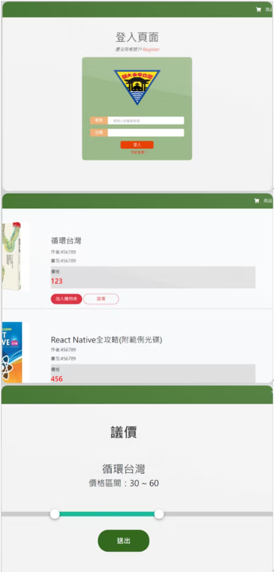

# Second-Hand_Bookstore_Platform
Build an online second-hand bookstore through connecting Front-end and Back-end. With creating different functional pages linked to User Interface, provide customers comfortable User Experience throughout the web design.

